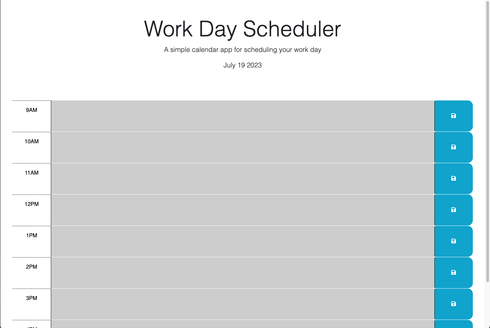

# Plans-Plans-Plans

## Description

The following assignment required the developer to create functions using jQuery. The assignment is completed when the developer is able to display the current date at the top of the calendar. When the planner is presented with time blocks for a standard business day that will display each time block in a different color depending if the time is in the past, present, or future when compared to the current time. When an event is entered by the user and saved by clicking on the save icon and finally when the event reappears when the user reloads the page later on in the day or for the next day.

## Website Link

[Work Day Scheduler](https://solis07.github.io/Plans-plans-plans/)

## Screenshot

